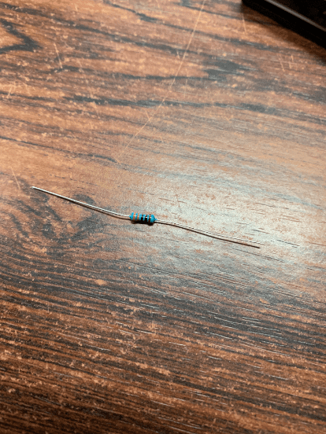
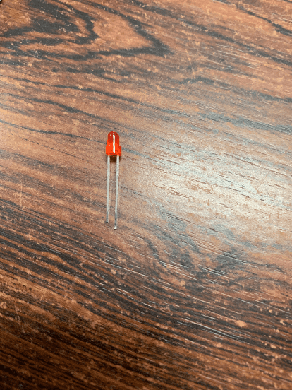
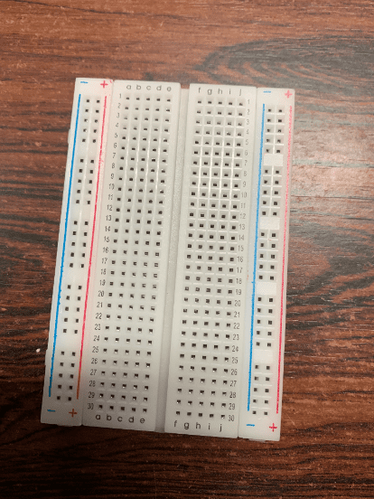
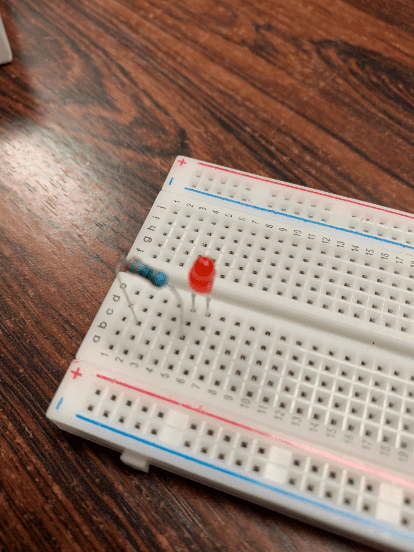
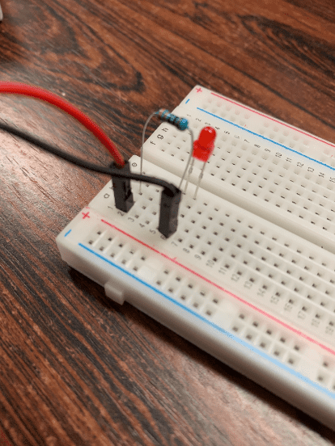
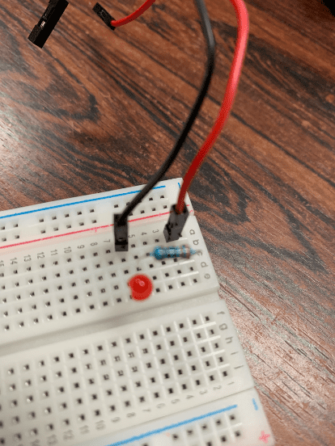
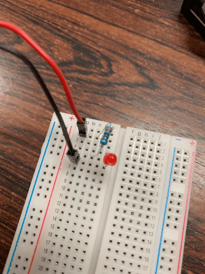

# はじめに

あなたはラズパイを買って何をしますか?  
そうですLチカです!!  
今回はそのLチカについて解説します。

## 方法

### 接続方法

#### 使用したもの

今回使用したものです。

- [Raspberry pi](https://www.raspberrypi.org/)
- [Raspbian](https://www.raspberrypi.com/software/operating-systems/)
- 330Ω抵抗
- LED
- [nano](https://nano-editor.org/)
- [vim](https://www.vim.org/)
- WiringPi
- [gcc](https://gcc.gnu.org/)
- [python](https://www.python.org/)

#### 使用したものの写真

では再び、必要なものを確認しましょう。
まずは抵抗です。330Ωのものを用意しましょう。



次に、LEDです。  今回は赤色を使いました。LEDは色によって仕様が違うので、よく確認してください。


そして、ブレッドボードです。  今回使うものは、はんだ付けしなくてよいので、電子工作体験にはうってつけかと思います。  これからブレッドボードの**アルファベットが縦に書かれている穴を列、数字が横に書かれているものを行と呼ぶ**ことにします。



#### ブレッドボードの説明

ブレッドボードは、前述のとおり、電子工作にはよく使われます。ブレッドボードには様々な種類がありますが、今回使用したものは**差し込み式**と呼ばれるものです。その名の通り、ジャンパワイヤをさしたり、LEDや抵抗を直接挿せます。  
**ブレッドボードは行で回路が導通して、列では導通していません。**

#### ブレッドボードへ接続

さて、ブレッドボードへ接続しましょう!  
今回作成する回路は、抵抗とLEDを接続した回路を作ります。  
その前に、回路に電流が流れる流れを説明します。  
回路は、プラス極からマイナス極へと電流が流れます。今回はそのことに留意して作ります。  なぜならば、**今回の回路は極性を間違えると、LEDが壊れるからです...**
それでは接続しましょう!
写真のように接続してください。



ここで、再び注意です。LEDには極性があります。**足の長いほうがプラスなので、抵抗側にあるかどうかを確認してください。**  
接続出来たら、ジャンパワイヤでラズベリーパイと、LEDを接続します。  
ジャンパワイヤのプラス極を抵抗の行に、ジャンパワイヤのマイナス極をLED側にそれぞれ接続してください。



上から見るとこんな感じです。





するとラズパイを電源を入れていて、正しく接続されていると、LEDが点灯するかと思います。ここで光らなかったら、もう一度やり直してください。  
**ジャンパワイヤや抵抗、LEDは奥まで挿す必要があります。**
正しく挿すとこんな感じですが、


正しく挿さってないと、こんな感じです。


以上の手順でLEDがとりあえず光ります!!

### プログラミングLピカ

今回のガイドでは、C言語とPythonを用いた実行方法をご紹介します。

#### Python

ターミナル上で、

```shell
nano main.py
```

と入力すると、nanoが立ち上がります。  
nanoの使い方は下のほうに出てきますが簡単に説明します。  
nanoは初心者向けのCUIエディタ言われて、vimより簡単だといわれています。  
一番のメリットは下のほうにキーボードのショートカットが表示されていることです。  
とは言いつつも、やはり難しいものです。簡単に下のほうに出てるものの紹介です。  
**^**キーは、Ctrlキーを意味しています。例えば**^C**と書いてあるものを実行したかったら、Ctrlキーを押しながらCキーを押すという意味です。  
ということでソースコードを入力しましょう!

```python
# GPIOを扱うためモジュールをインポートする
import RPi.GPIO as GPIO
# 時間を扱うためモジュールをインポートする
import time
# GPIOに対応するピン番号
PNO = 3
# ピン番号の指定
# BOARDとすることで、ラズパイ間で共通にコードが使える
GPIO.setmode(GPIO.BOARD)
# GPIOのピン番号(ここでは3番ピン)を出力に設定する
GPIO.setup(PNO, GPIO.OUT)
# print⽂は、標準出力(ターミナルの画面上)に文字を表示する命令
# 何回LEDを点灯するか質問している
print("How many times?")
# 変数へキーボードから入力された値を代入している
# 変数は、値を保存する箱のようなもの
loopn = input()
# どれぐらいの間隔でLEDのオンとオフをするか聞いている
print("How long sleep?")
stop = input()
# 0~⼊⼒された数未満まで繰り返す
# iはカウンタ用の変数で、loopn回だけ繰り返す
for i in range(loopn):
    # HighでLEDを光らせる
    GPIO.output(PNO, GPIO.HIGH)
    # その状態を保持する
    time.sleep(stop)
    # LowでLEDを消す
    GPIO.output(PNO, GPIO.LOW)
    time.sleep(stop)
# これは、GPIOをほかのプログラムからでも使えるようにするための終了処理
# これがないとLEDがオフのままになる
GPIO.cleanup()
```

上記のソースを実行するにはターミナル上で、

```shell
python main.py
```

と入力すると、指定した回数、間隔で動作します!

#### C言語

ターミナル上で、

```shell
nano main.c
```

と入力すると、nanoが立ち上がるので、下記に示したソースコードを入力してください。

```c
#include <wiringPi.h> //GPIOを扱うためのライブラリ
#include <stdio.h> //printf関数を使うためのライブラリ
#define LED_PORT 8 //GPIOに対応するポート番号
#define LED_ON 1 //LEDがオン
#define LED_OFF 0 //LEDがオフ

//プログラムはmain関数から始まります
int main() {
 //loopnはループの終了条件、stopはLEDの点滅間隔
 int loopn, stop;
 //配線の初期化
 wiringPiSetup();
 // ピン番号の指定
 pinMode(LED_PORT, OUTPUT);
 //printf文は標準出力へ出力する
 //ループの回数を聞いている
 printf("How many times?");
 //scanfは変数にキーボードから入力した値を代入する関数
 //ループの回数を入力して代入している
 scanf("%d", &loopn);
 //どれくらいの間隔か聞いている
 printf("How long sleep?");
 scanf("%d", & stop);
 //iはループ用の変数
 //loopnを満たさない回数つまり0<loopn回繰り返す
 //i++でループのたびにカウンタを増やしている
 for (int i = 0; i < loopn; i++) {
     //LEDを光らせる
     digitalWrite(LED_PORT, LED_ON);
     //delay関数で間隔を指定する
     delay(stop);
     //0でLEDを消す
     digitalWrite(LED_PORT, LED_OFF);
     delay(stop);
   }
 return 0;
}
```

そして、入力して実行する際にはターミナル上で、以下のコマンドを入力してください。

```shell
make
```

makeはMakefileに書かれた内容を実行するという意味です。

```shell
gcc main.c -lwiringPi
./a.out
```

## おわりに

ラズパイと言ったらLチカですよね。一度Lチカをするといろいろなことに手を出したくなりますよね  
電子情報工学科では、このような電子工作をしています。  
興味がわいたらJ科の[シラバス](https://syllabus.kosen-k.go.jp/Pages/PublicSubjects?school_id=13&department_id=13&year=2021&lang=ja)を見るといいです。
