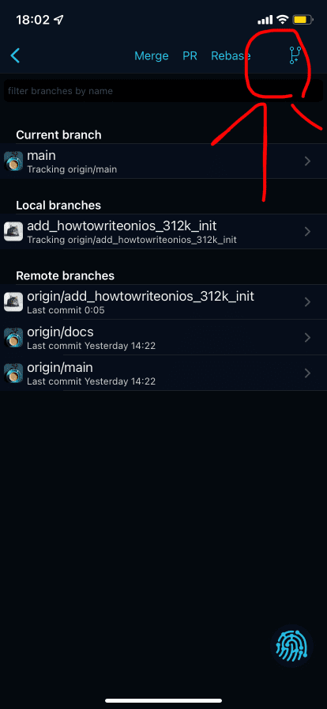
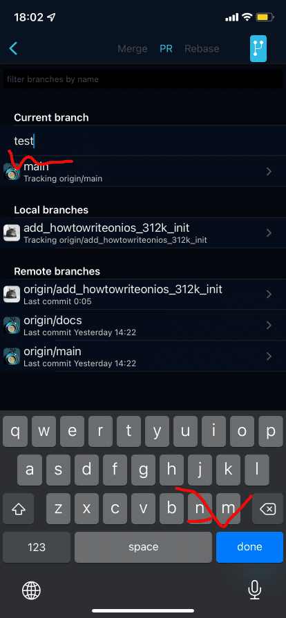
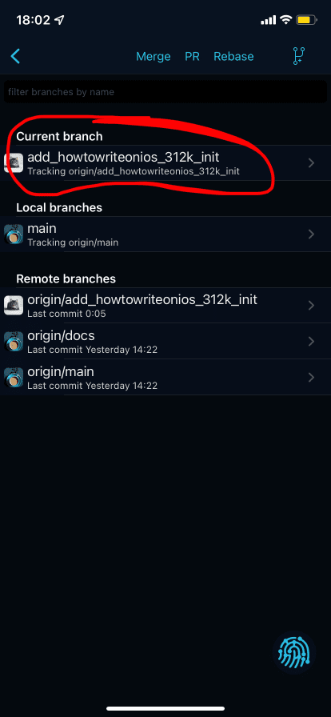
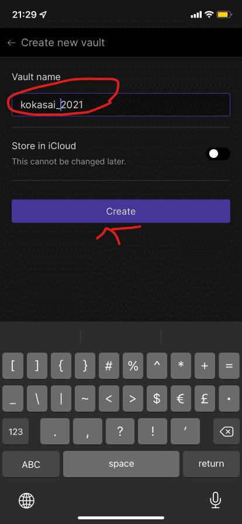
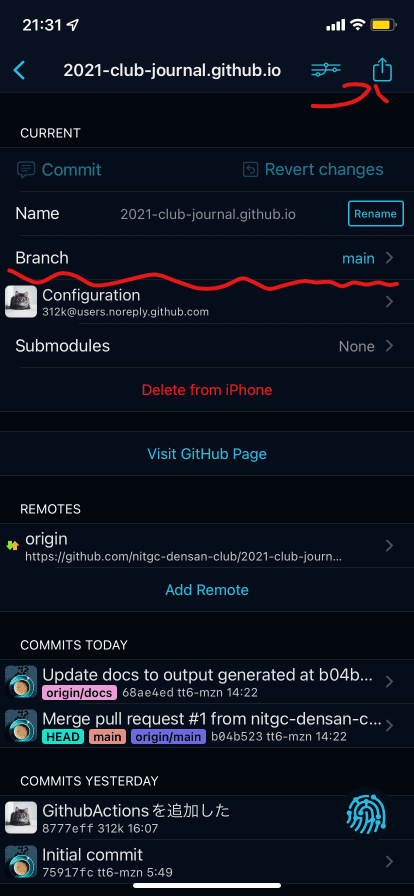
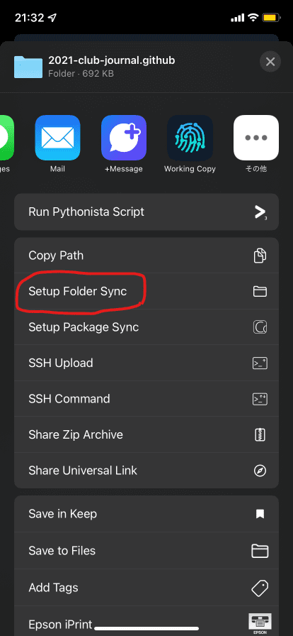
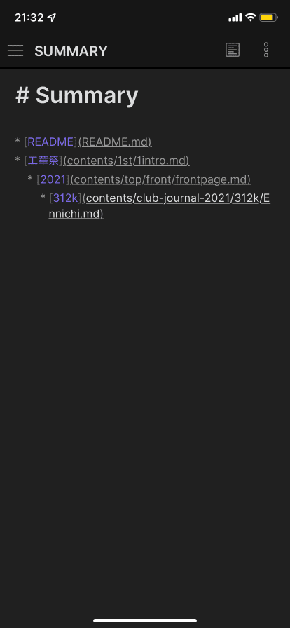

# はじめに

多くの方は、マークダウンを書くときにはパソコンを使うかと思います。しかし、実はパソコンがなくてもマークダウンはかけるのです！  
そこで今回はスマホでマークダウンを書く方法についてご紹介します。
このガイドは、rsteeleさんの
[[Mobile] Setting up iOS git-based syncing with mobile app (using Working Copy)](https://forum.obsidian.md/t/mobile-setting-up-ios-git-based-syncing-with-mobile-app-using-working-copy/16499)
を参考にして書きました。

## 前提条件

[working copy](https://apps.apple.com/jp/app/working-copy-git-client/id896694807)
を自由に使うためには、Proアカウントが必要です。(無課金でも使える機能はあります)。
もし、あなたが学生ならば、working copy様が、学生向けにプランを出してくださっています。
なお、この記事はios向けです。

## アプリをインストール

さて、さっそくアプリをインストールしましょう。
必要になるのは、

- [working copy](https://apps.apple.com/jp/app/working-copy-git-client/id896694807)
- [obsidian](https://apps.apple.com/jp/app/obsidian-connected-notes/id1557175442)

の2つのアプリが必要です。

## Working Copyのセットアップ

1. [Working Copy for students](https://workingcopy.app/education/)
にアクセスして、tap hereのリンクを押します。  

2. アプリが自動で開かれるので、Githubのアカウントでサインインしてください。  

3. サインインしたら、クローンします。右上の **+** ボタンをタップして、**Clone repository**をタップします。  

4. すると、クローンするリポジトリが表示されるので、ここでは例として、電算部のリポジトリを指定しています。入力したら、

``` URL
https://github.com/nitgc-densan-club/2021-club-journal.github.io.git
```

**Clone**してください。
5. クローンしてきたら、ブランチを切ります。  
**権限がない場合ブランチを切らないとRejectされますので注意です!**
**リポジトリ名**->**Repository**->**Branch**の順でタップしてください。  

6. タップしたら、ブランチ一覧が表示されます。そこの右上のブランチアイコンをタップしてください。  

7. ブランチの名前を付けることができます。ルールに従ってブランチ名をつけてください。  

8. これでブランチが新規作成されました!  


## OBSIDIANのセットアップ

1. Obsidianを開き、**Create new vault**をタップしてください。  

2. すると、名前を聞かれるので、お好きな名前を付けてみてください。ここでは**kokasai_2021**にしました。  

3. すると、作業環境が開かれるので、
右上のハンバーガーボタン->設定アイコン->About
の順にタップして、Languageに日本語を設定して、Relaunchを、Override config folderには
**.obsidian.mobile**

と入力して、Relaunchしてください。  


## Working CopyとObsidianの共有

ここでは、Working CopyとObsidianの共有方法について説明します。

1. Working Copyのセットアップの5節まで進めたら、右上の共有ボタンをタップしてください。  

2. 共有画面が出たら、**Setup Folder Sync**をタップしてください。  

3. Obsidianに先ほど用意したディレクトリを選択してください。  

4. Obsidianを開くとフォルダが開きました!  


## おわりに

以上で編集できるようになりました。
Obsidianは非常に便利な編集アプリですので是非使ってみてください。
